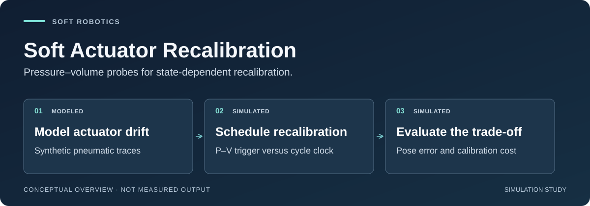

# Soft Actuator Recalibration

**When should a soft robot recalibrate? A reproducible simulation study of
pressure–volume probes and pressure-only pose estimation.**

> **Publication hold:** archived v1.3 contains a methods overstatement. Read the
> [correction notice](docs/corrections/v1.3-methods-2026-09-05.md) and
> [corrected manuscript candidate](docs/preprint_v1_4_candidate.md) together.
> Author review is pending; no corrected PDF, arXiv identifier, or DOI is claimed.
> A passing historical-PDF check does not authorize publication.

[](https://github.com/500ft/soft-actuator-recalibration/actions/workflows/ci.yml)
[](docs/results.md)
[](.github/workflows/ci.yml)

[Start here](docs/START_HERE.md) · [Evidence](#evidence-snapshot) ·
[Quick start](#quick-start) · [Documentation](#documentation) ·
[Author review](docs/AUTHOR_REVIEW_DAY3.md)



*Conceptual research map, not hardware or an experimental result. The Study 3
health probe is analytic and separate from the noisy pose-observation channel.*

## About

A soft pneumatic actuator's pressure-to-pose calibration can drift as its
material changes. Recalibrating constantly has a cost; never recalibrating lets
error grow. This project asks whether an intermittent P-V probe can inform that
decision while normal pose estimation continues to use pressure alone.

The repository combines a pneumatic-network simulator, fatigue and sensing
models, pose estimators, four study runners, and checks connecting figures and
reported numbers to committed artifacts. Its strongest current contribution is
the **recalibration-policy comparison and its limits**, not the discovery that
hysteresis changes with fatigue.

| Research question | Current scope |
| --- | --- |
| Does a state-based trigger improve the error/event-count trade-off? | Synthetic actuators from one degradation generator |
| Does shared-manifold coupling dominate pose error? | Conditional network-sensitivity study, including a negative result |
| Does the deployed trigger warn before the error budget is crossed? | No positive lead at `tau = 0.05` |
| Does this work on physical actuators? | Not established; no physical testing is included |

## Evidence snapshot

These are committed **simulation outputs**, not device measurements. The
[results summary](docs/results.md) states the inference boundaries.

| Finding | Evidence and interpretation |
| --- | --- |
| Synthetic evaluation cohort | 2,000 traces; split by actuator identity. [Dataset manifest](data/sim/phaseD/manifest.json) |
| P-V association with pose drift | Pooled `r = 0.885`; actuator-cluster interval `[0.853, 0.950]`, with only six held-out identities. [Cluster results](data/sim/phaseD/study3_cluster_ci_results.json) |
| Calibration-event trade-off | Two events versus five for always-on, including initialization; meets the train-derived macro-averaged stage-RMSE budget. Not a continuous accuracy guarantee. [Study 3](data/sim/phaseD/study3_results.json) |
| Temporal lead | The deployed `tau = 0.05` has no positive lead; lower thresholds trade more events for earlier triggering. [Interpretation](docs/results.md#study-3-recalibration-policy) |


*Committed Study 3 simulation plot. Event counts include initial calibration;
probe overhead and recalibration downtime were not measured. See the
[generator and inputs](docs/data-and-figures.md#study-3-recalibration-policy).*

## Quick start

Python 3.11 is the CI target. Start with checks of the existing artifacts; these
commands do not rerun the studies or replace frozen result files.

```bash
git clone https://github.com/500ft/soft-actuator-recalibration.git
cd soft-actuator-recalibration
python -m venv .venv
source .venv/bin/activate
python -m pip install -r requirements.txt pytest reportlab pypdf
python -m pytest -q
python -m scripts.check_manuscript_numbers
python -m scripts.check_pdf_arxiv
python -m scripts.check_publication_fallback
```

The numeric checker covers historical and candidate Markdown. The PDF checker
checks **historical v1.3 only**. The fallback check can pass archive integrity
while correctly reporting publication **BLOCKED**. The separate command
`python -m scripts.check_publication_fallback --for-publication` is expected to
exit **2** while the correction is unapproved.

For study regeneration, dependency boundaries, and the local `readline`/pytest
workaround, use the [reviewer guide](docs/START_HERE.md#reviewer-reproduce-the-checks).
Study runners write under `data/`; run them only in a disposable checkout after
recording the source revision. Regeneration is not publication clearance.

## Documentation

| Start with | What it answers |
| --- | --- |
| [Reading guide](docs/START_HERE.md) | Which path should a recruiter, reviewer, or contributor follow? |
| [Results and limitations](docs/results.md) | What did the studies actually establish? |
| [Data and figures](docs/data-and-figures.md) · [Figure manifest](docs/figure-manifest.json) | Which inputs and commands produced each computational figure? |
| [Author-review packet](docs/AUTHOR_REVIEW_DAY3.md) | Which interpretation and release decisions are still open? |
| [Correction](docs/corrections/v1.3-methods-2026-09-05.md) · [Candidate manuscript](docs/preprint_v1_4_candidate.md) | What differs from the archived account? |
| [Prospective v2 claim spine](docs/specs/robosoft-v2/claim-spine.md) | Which stronger tests are proposed, rather than accomplished? |
| [Literature review](docs/A01_A04_Literature_Review.md) | How does the study relate to prior work? |
| [Review index](docs/REVIEW_READY.md) | Where are check outputs, provenance, and remaining gates? |

```text
sim/        pneumatic, fatigue, sensing, and kinematic models
pipeline/   feature extraction, health signals, and estimators
scripts/    study runners, plot generation, and artifact checks
tests/      model, policy, figure, and publication regression tests
data/       committed synthetic artifacts; large dataset regenerated separately
docs/       methods, results, manuscripts, and review records
evidence/   recorded checks and reproducible counterexamples
```

## Next decision and limitations

The next release gate is **author review of the methods correction**, followed
by a separately versioned corrected artifact—not a silent rewrite of v1.3.
The [review packet](docs/AUTHOR_REVIEW_DAY3.md) recommends retaining cluster-level
uncertainty and the historical `tau = 0.05` result. A changed selection rule
belongs in prospective work, not a retuned evaluation of known test identities.

The association is structurally favored because both endpoints share latent
fatigue. Study 3 uses a separate idealized SLS probe with zero rest; health-probe
noise and variable-rest robustness are not demonstrated. Five life stages do
not establish continuous warning performance, and synthetic identity holdout
does not establish transfer across physical mechanisms or materials.

## Contributing, citation, and license

Read [CONTRIBUTING.md](CONTRIBUTING.md) before changing code or generated
artifacts. Report a reproducible issue with the command, source revision, and
expected versus observed behavior; do not promote proposed tests to results.

[CITATION.cff](CITATION.cff) describes the **historical v1.3 manuscript**, whose
title and metadata are preserved. Cite the exact source version and include the
correction when discussing its claims. The professional repository name is not
a new paper title or publication. See [repository identity](docs/REPOSITORY_IDENTITY.md).

Source code: [MIT](LICENSE). Manuscript text, documentation, and figures:
[CC BY 4.0](LICENSE-docs). Submission instructions remain in
[SUBMISSION.md](docs/SUBMISSION.md) and [ZENODO_FALLBACK.md](docs/ZENODO_FALLBACK.md);
neither supersedes the publication hold.
