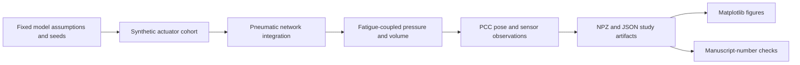

# Data and Figure Provenance

This repository contains generated simulation data rather than physical actuator
measurements. The figure registry covers computational result plots under
`data/gate0/` and `data/sim/`; manuscript PDFs and third-party reference PDFs are
outside its scope.

The machine-readable companion is [`figure-manifest.json`](figure-manifest.json).

## Data lineage



## Evidence classification

Every registered plot has `evidence_type: simulation`. The generator uses
transparent but assumed fatigue laws, pneumatic parameters, actuator geometry,
and sensor models. Held-out evaluation separates actuator identities generated
by the same model; it does not introduce experimental data.

## Gate 0: pneumatic cross-talk

- **Generator:** `scripts/gate0_lumped_rc.py`
- **Command:** `python -m scripts.gate0_lumped_rc`
- **Method:** lumped R-C pneumatic model with randomized parameter robustness
  cases.
- **Outputs:** coupling versus frequency, compliance, and DC-independence plots
  in `data/gate0/`.

## Phase A: plant consistency

- **Generator:** `scripts/phaseA_plant_demo.py`
- **Command:** `python -m scripts.phaseA_plant_demo`
- **Method:** standard-linear-solid wall and numerical P-V loop calculations.
- **Outputs:** P-V loops, frequency response, and Gate-0 consistency plots in
  `data/sim/phaseA/`.

## Phase B: fatigue trajectory

- **Generator:** `scripts/phaseB_fatigue_demo.py`
- **Command:** `python -m scripts.phaseB_fatigue_demo`
- **Method:** deterministic Mullins, slow-fatigue, accelerating-fatigue,
  recovery, and leak laws from `sim/fatigue.py`.
- **Outputs:** fatigue, recovery, leak, onset, pressure-decay, and P-V loop plots
  in `data/sim/phaseB/`.

## Study 1: indicator checks

- **Generator:** `scripts/run_study1.py`
- **Command:** `python -m scripts.run_study1`
- **Inputs:** synthetic fatigue trajectories, corruptions, and a generated
  validation cohort.
- **Outputs:** detector, recovery, fixture, fusion, and generalization plots in
  `data/sim/study1/`.

## Phase D dataset

`scripts/phaseD_dataset.py` creates the shared dataset used by Studies 2 and 3:

- 20 deterministic synthetic actuators;
- five life fractions;
- isolated and shared supply topologies;
- contact and no-contact cases;
- five repetitions;
- 2,000 traces on a fixed time grid;
- actuator-identity train and held-out partitions.

The generator writes `dataset.npz` and `manifest.json`; the manifest records the
seed, design, actuator table, array shapes, split, and dataset SHA-256.

```bash
python -m scripts.phaseD_dataset
```

## Study 2: drift and correctors

- **Generator:** `scripts/run_study2.py`
- **Command:** `python -m scripts.run_study2`
- **Inputs:** `data/sim/phaseD/dataset.npz` and `manifest.json`.
- **Outputs:** drift and static-versus-dynamic figures plus JSON results.

## Study 3: recalibration policy

- **Generator:** `scripts/run_study3.py`
- **Command:** `python -m scripts.run_study3`
- **Inputs:** the Phase D dataset and manifest.
- **Method:** static ridge calibration, train-selected P-V and clock thresholds,
  and evaluation on held-out actuator identities.
- **Separate health-signal lineage:** `scripts/run_study3.py` calls
  `pipeline/coupling.py::health_trajectory`, which computes analytic SLS loop
  area after `fatigue_state` with zero rest. It does not integrate the noisy,
  quantized, decimated Phase D volume observations. Do not infer Study 3
  health-probe noise or variable-rest robustness from the dataset sensor model.
- **Endpoint:** macro-average of stage-level pose RMSE, then across actuators;
  not maximum or continuously bounded error. Event counts include initialization.
- **Outputs:** the leading-indicator and recalibration-trade-off figures plus
  `study3_results.json`.

## Study 4: network sensitivity

- **Generator:** `scripts/run_study4.py`
- **Command:** `python -m scripts.run_study4`
- **Method:** supply-resistance and manifold-compliance sensitivity sweep.
- **Outputs:** `study4_fig_crosstalk_sensitivity.{png,pdf}` and JSON results.

## Reproduction boundary

Recreating a figure confirms deterministic execution of the committed model and
analysis. It does not validate the model parameters against a physical actuator.

## Study A — dispersion vs indicator invariance (observability program)

- **Generator:** `scripts/run_studyA.py` · **Command:** `python -m scripts.run_studyA` (51 s)
- **Inputs:** `pipeline/dispersion.py` (seed 20260916), `sim/fatigue.py`, `sim/plant.py`, `sim/sensors.py`
- **Outputs:** `data/sim/studyA/studyA_results.json`, `studyA_fig_indicator_spread.(png|pdf)`, `studyA_fig_ablation.(png|pdf)`
- **Preregistration:** `docs/specs/observability-program/studyA-preregistration.md`; verdict field in the JSON.
- **Boundary:** assumed dispersion magnitudes on a synthetic generator; the verdict is about whether this
  cohort can pose the cross-unit question, not about physical actuators.

## Study B — identifiability map (observability program)

- **Generator:** `scripts/run_studyB.py` · **Command:** `python -m scripts.run_studyB` (minutes; 24 sensor repeats per point)
- **Inputs:** `pipeline/identifiability.py`, `pipeline/dispersion.py`, `sim/fatigue.py`, `sim/plant.py`, `sim/sensors.py`
- **Outputs:** `data/sim/studyB/studyB_results.json`, `studyB_fig_identifiability_map.(png|pdf)`
- **Preregistration:** `docs/specs/observability-program/studyB-identifiability.md`.
- **Boundary:** local Cramér–Rao bounds from finite-difference sensitivities of the synthetic generator's
  pressure-only features; a map of where the latent life coordinate is identifiable *in this generator*.

## Study C — unseen-unit transfer (observability program)

- **Generator:** `scripts/run_studyC.py` · **Command:** `python -m scripts.run_studyC` (~4 min)
- **Inputs:** `pipeline/dispersion.py` (seeds 20260916, 20260918), `pipeline/identifiability.py` features, `sim/*`
- **Outputs:** `data/sim/studyC/studyC_results.json`, `studyC_fig_transfer.(png|pdf)`
- **Preregistration:** `docs/specs/observability-program/studyC-transfer.md` (amendment of 2026-09-16 fixes the trajectory design).
- **Boundary:** one estimator on a synthetic dispersed cohort; verdict per the spec's rule; no device claim.
